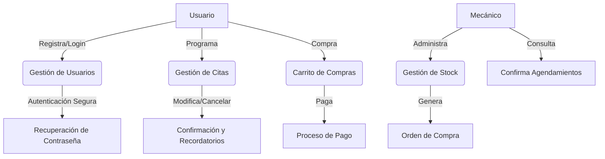

# Informe Final del Proyecto

### Proyecto: Garras y Tuercas
### Curso: Experto en Ciberseguridad
### Integrantes:
+ Francisca Molina - Analista
+ Sebastian Ávila - Implementador
+ Dana Valdebenito - Evaluadora

### Fecha Entrega: 13-08-2024
___

## Indice
1. [Introducción](#introducción)    
    1.1 [Objetivo](#objetivo)    
    1.2 [Roles](#roles)   

2. [Descripción del Proyecto](#descripción-del-proyecto)    
    2.1 [Visión General](#visión-general)   
    2.2 [Características del Sistema](#características-del-sistema) 

3. [Análisis De Requisitos](#análisis-de-requisitos)    
    3.1 [Requisitos Funcionales](#requisitos-funcionales)   
    3.2 [Requisitos No Funcionales](#requisitos-no-funcionales)

4. [Desarrollo Seguro](#desarrollo-seguro-rol-del-implementador)
5. [Implementación](#implementacion-rol-del-implementador)
6. [Evaluación del Sistema](#evaluacion-del-sistema-rol-del-evaluador)
7. [Conclusiones](#conclusiones)
8. [Anexos](#anexos)

___

## Introducción

##### Objetivo:

El presente informe tiene como objetivo detallar el despliegue final de la aplicación Garras y Tuercas, bajo la perspectiva de un desarrollo seguro, utilizando diversas herramientas y técnicas adquiridas a lo largo del curso. La finalidad de esto es lograr entregar un sistema confiable de autogestión de servicios, tanto para los clientes como para el taller.

#### Roles:

Analista: Encargado de identificar los requisitos funcionales y no funcionales, analizar necesidades de seguridad de la aplicación, evaluar posibles amenazas de seguridad y proponer medidas de protección de datos sensibles.

Implementador:

Evaluador:

## Descripción del Proyecto: 

#### Visión general: 

La página de Garras y Tuercas ofrece a usuarios la posibilidad de agendar sus servicios y realizar compras de manera online, esto a través de una cuenta de usuario que deben crear previamente. 

#### Características del Sistema: 

Este sistema cuenta con una página para crear una cuenta de usuario, una para iniciar sesión, y un Home el cual esta enlazado a los diferentes servicios: agendar citas, comprar repuestos y página de contacto.   
___

## Análisis de Requisitos
En esta sección se detallan los requisitos considerados al momento de desarrollar el proyecto, tanto los funcionales como no funcionales, considerando sus aspectos de seguridad.

#### Requisitos Funcionales

+ *Registro de usuarios:* 
    + Descripción: Los usuarios deben poder crear una cuenta en la página, entregando información personal y de contacto. 
    + Campos Requeridos: Nombres, apellidos, dirección de correo electrónico, número de contacto, credenciales de acceso (nombre de usuario y contraseña).
    + Validación de los datos: Validación de entradas (como el formato de correo electrónico).

    

+ *Inicio de Sesión:* 
    + Descripción: Los usuarios deben poder acceder al sistema a través de autenticación de usuario y contraseña o mediante Google Sign-In. Se anexa un [diagrama de flujo](#diagrama-casos-de-uso) para los casos de uso.
    + Campos Requeridos: Dirección de correo electrónico y contraseña, opción de inicio de sesión con Google.
    + Función Adicional: Recuperación de contraseña a través de un enlace enviado al correo electrónico del usuario.

    

+ *Calendario de Agenda:*
    + Descripción: Los usuarios deben poder ver y gestionar (crear, modificar, eliminar) sus citas en un calendario.
    + Funcionalidades: Agrega, edita y elimina citas, ver las citas agendadas, opción para solicitar servicios de Scanner OBD2.

    
    
+ *Compra de Repuestos:*
    + Descripción: Los usuarios deben poder seleccionar productos, agregarlos a un carro de compras, y proceder a la compra.
    + Funcionalidades: Agregar productos al carro, ver detalles del carro, proceder al pago, eliminar productos del carro.

    

#### Requisitos No Funcionales
+ *Seguridad:*
    + Autenticación y autorización: Implementación de OAuth 2.0 para autenticación segura y control de acceso basado en roles (RBAC).
    + Hashing de contraseñas: Uso de `password_hash()` para almacenamiento seguro de contraseñas.

+ *Protección de datos en transmisión:*
    + Uso de protocolos TLS/SSL para cifrado en tránsito.

+ *Monitoreo y Auditoría:*
    + Registro y monitoreo constante de la actividad en el sistema a través de logs.
    + Actualizaciones y Copias de Seguridad: Implementar un calendario con actualizaciones regulares y asegurar copias de seguridad de manera periódica.

+ *Usabilidad:*
    + Interfaz de usuario: Esta debe ser intuitiva y fácil de usar para todos los usuarios.

+ *Rendimiento:*
    + La aplicación debe ser capaz de manejar múltiples usuarios a la vez.
    + El tiempo de carga de la página debe ser rápido y eficiente.

+ *Cumplimiento Legal:*
    + La página debe cumplir con las leyes y regulaciones del territorio Chileno e internacionales relacionadas a la protección de datos y privacidad.

## Desarrollo Seguro (Rol del Implementador)
(Planificación de Seguridad: Cómo se planificó la seguridad desde el inicio del proyecto.
Implementación de Medidas de Seguridad (Rol del Implementador):
Autenticación y Autorización: Descripción de las técnicas de autenticación (incluso Google Sign-In) y cómo se implementó el control de acceso basado en roles (RBAC).
Cifrado: Detalles sobre el cifrado en reposo (AES-256) y cómo se implementó.
Protección de Datos: Cómo se manejaron y protegieron los datos sensibles (contraseñas, correos electrónicos, etc.).
Validación de Entradas: Métodos utilizados para validar y sanitizar entradas del usuario para prevenir ataques como SQL Injection y XSS.
Pruebas de Seguridad: Tipos de pruebas realizadas (pruebas de penetración, escaneos de vulnerabilidades, etc.) y sus resultados.
Integración de Seguridad en el Desarrollo: Cómo se integraron las prácticas de seguridad en el ciclo de vida del desarrollo (SDLC).)

## Implementacion (Rol del Implementador)
(Descripción del Proceso de Implementación: Detalles sobre la implementación técnica, herramientas utilizadas, y decisiones clave tomadas.
Desafíos y Soluciones en la Implementación: Problemas encontrados durante la implementación y cómo se resolvieron.)

## Evaluacion del sistema (Rol del Evaluador)
(Métodos de Evaluación: Descripción de los métodos utilizados para evaluar la seguridad y el funcionamiento del sistema.
Resultados de la Evaluación: Resumen de los hallazgos y la efectividad de las medidas de seguridad implementadas.
Recomendaciones para Mejoras: Sugerencias basadas en la evaluación para futuras mejoras en el sistema.)

## Conclusiones

Durante el desarrollo de este sistema se abordaron varias aristas para lograr garantizar la seguridad y funcionalidad del mismo, incluyendo implementación de medidas robustas para proteger datos sensibles y la integración de prácticas seguras desde la fase inicial del proyecto.
El principal foco fue garantizar seguridad y protección de los datos, logrado a través de diferentes herramientas y técnicas como el uso de TSL/SSL, el control de acceso basado en roles, el hasheo de contraseñas para su almacenamiento seguro o las consultas preparadas.
Los requisitos del sistema contemplan creación y gestión de cuentas de usuario, hasta integración de calendario de agendas y compra de repuestos: Por eso se contemplan medidas de seguridad extra como el consentimiento informado, políticas de uso y privacidad, notificaciones de brechas de seguridad, las cuales son incorporadas para cumplir con estándares legales y garantizar la confianza del usuario.
A lo largo del desarrollo se enfrentaron múltiples desafíos como integrar varias capas de seguridad o implementar funcionalidades complejas. Las soluciones adoptadas incluyeron seguimiento de mejores prácticas en seguridad informática para mitigar riesgos y garantizar un sistema confiable.
A pesar de que el proyecto esta construido sobre una base sólida, se recomienda seguir en constante evaluación y actualización de los sistemas, adaptándose a nuevas amenazas y cambios en los requisitos de los usuarios. Esto conlleva implementación de actualizaciones y copias de seguridad periódicas con el objetivo de garantizar la integridad y disponibilidad del sistema.
En síntesis, el proyecto logró satisfacer los objetivos de seguridad y funcionalidad que se propusieron, otorgando una plataforma segura y eficiente para los usuarios del taller mecánico. La colaboración entre los diferentes roles fue clave para el éxito del proyecto, asegurando que se cumplieran los estándares mínimos y se manejaran eficientemente los desafíos técnicos.
___

## Anexos

#### Diagrama Casos de Uso

