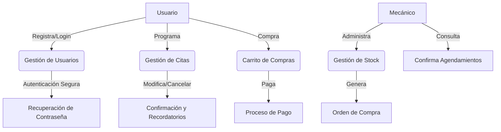
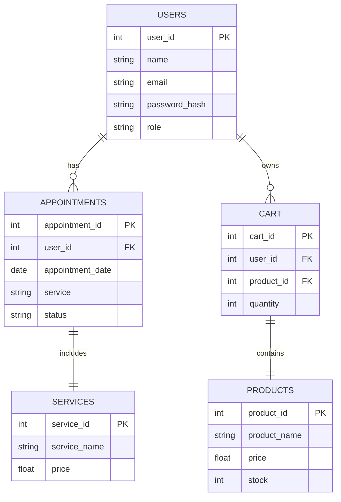

# Informe de Estado del Proyecto

#### Proyecto: Garras y Tuercas
#### Integrantes: Sebastian Ávila, Francisca Molina, Dana Valdebenito
#### Curso: Experto en Ciberseguridad
#### Fecha Entrega: 05-08-2024
#### Rol: Analista

___

## Introducción

El presente informe tiene como objetivo detallar avances y cambios realizados en el proyecto Garras y Tuercas, además de evaluar riesgos de seguridad para alcanzar estándares apropiados de protección de datos sensibles. La finalidad de esto es lograr entregar un sistema seguro de autogestión de servicios, confiable para los clientes como para el taller.
___

## Análisis de Requisitos
En esta sección se contemplan los avances implementados en el sistema en los diferentes requisitos funcionales y no funcionales considerados.

#### Gestión de usuarios
+ Registro y Login: Los usuarios deben poder registrarse y acceder al sistema a traves de autenticacion segura. Esta contempla uso de HTTPS y la integracion de hashing de contraseñas para cifrado en tránsito.

```php
// Hashea la contraseña durante el registro
$hashed_password = password_hash($password, PASSWORD_DEFAULT);
```
```php
// Verifica la contraseña al iniciar sesión
if (password_verify($password, $hashed_password)) {
    echo "Inicio de sesión exitoso";
} else {
    echo "Nombre de usuario o contraseña incorrectos";
}
```

+ Roles y permisos: Se definen roles de cliente, mecánico y administrador, cada una con permisos especificos. Se asigna cada rol en la base de datos y luego al autenticar se corrobora rol y permiso

```php
// Se obtienen los permisos del rol del usuario
    $sql = "SELECT p.permission_name FROM permissions p
            JOIN role_permissions rp ON p.permission_id = rp.permission_id
            WHERE rp.role_id = ?";
    $stmt = $conn->prepare($sql);
    $stmt->bind_param("i", $role_id);
    $stmt->execute();
    $result = $stmt->get_result();
    
    $permissions = [];
    while ($row = $result->fetch_assoc()) {
        $permissions[] = $row['permission_name'];
    }
    $stmt->close();
    $conn->close();
```
```php
// Inicia sesión y almacena los permisos
    session_start();
    $_SESSION['username'] = $username;
    $_SESSION['role_id'] = $role_id;
    $_SESSION['permissions'] = $permissions;
```

#### Gestión de Servicios

+ Agendamiento: Los clientes deben poder agendar, modificar y cancelar citas. Estos datos almacenados en la BDD se mantendran cifrados bajo el protocolo AES256.

```php
// Inserta el usuario en la base de datos con la contraseña cifrada
$sql = "INSERT INTO users (username, encrypted_password) VALUES (?, AES_ENCRYPT(?, ?))";
$stmt = $conn->prepare($sql);
$stmt->bind_param("sss", $username, $hashed_password, $secret_key);
```
+ Compra de Repuestos: Los clientes deben poder agregar productos  a un carrito de ventas, poder modificar cantidades y eliminar productos. Además se integra un sistema seguro para el proceso de pago en línea (Transbank).

___

## Posibles Amenazas
 
 + Robo de credenciales: Acceso no autorizado a cuentas de usuarios. 
    + Mitigacion: Hasheo de contraseñas e implementacion de autenticacion MFA
+ Ataques de Fuerza Bruta: Intentos reiterados de inicio de sesion en base a prueba y error.
    + Mitigación: Implementación de captchas y limites de intentos de inicio de sesion.
 + Inyección de SQL: Inyección de código malicioso en la BDD  para acceder a ella y/o modificar datos sensibles
    + Mitigacion: Sanitización de entradas, utilización de consultas preparadas en las interacciones con la BDD
+ Ataques Man-in-the-Middle (MitM): Interceptación de datos durante la transmisión.
    + Mitigación: Uso de cifrado TLS/SSL, uso de HSTS (HTTP Strict Transport Security) para obligar a los navegadores a solo interactuar a traves de conexiones HTTPS.
+ Acceso No Autorizado a Datos Almacenados: Exposición de datos sensibles de usuarios y/o vehiculos.
    + Mitigación: Cifrado de datos en reposo via AES256 para evitar el acceso a la informacion contenida, controles de acceso estrictos de usuarios para mitigar el riesgo
+ Malware y Ransomware: Riesgo de infectar datos y sistemas, comprometiendo la confidencialidad, integridad y disponibilidad de estos.
    + Mitigación: Uso de antimalware y herramientas de monitoreo, actualizaciones regulares de software, copias de seguridad periódicas.

___

## Conclusión

Al finalizar la entrega de este avance podemos resaltar la necesidad de ajustar ciertos cambios al sistema para mantener un alto estándar de seguridad enfocado a las necesidades de la aplicación y los datos sensibles que se almacenarán. El uso de protocolos de cifrado, de autenticación segura, el acceso mediante roles y las consultas preparadas son algunas de las medidas utilizadas para robustecer la seguridad de la aplicación y garantizar la protección de estos activos. Se destaca la importancia de mantenerse al día en los ataques más comunes para darle un foco flexible a estas consideraciones y estar preparado para estos diferentes riesgos que están en constante actualización.

___

## Diagramas

#### Casos de Uso



#### Esquema de la Base de Datos

