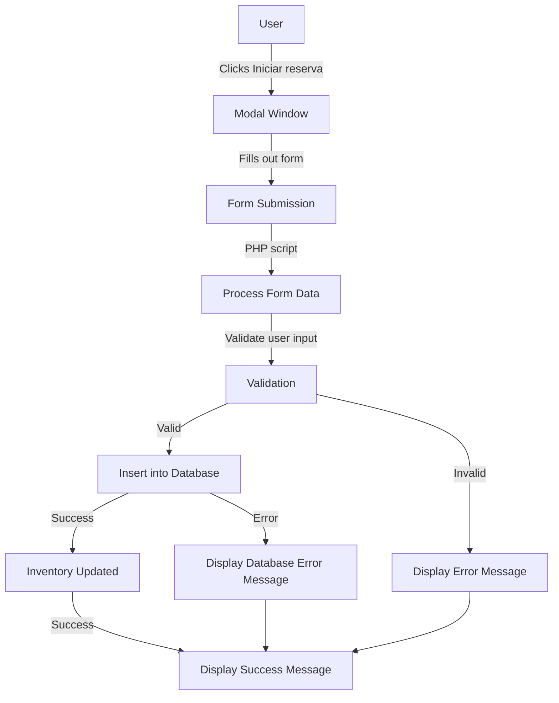
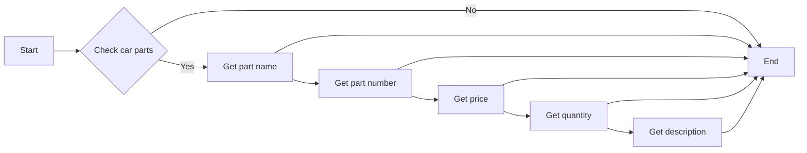

# Informe de Estado del Proyecto

#### Proyecto: Garras y Tuercas
#### Integrantes: Sebastian Ávila, Francisca Molina, Dana Valdebenito
#### Curso: Experto en Ciberseguridad
#### Fecha Entrega: 05-08-2024
#### Rol: Implementador

___

## Introducción

El presente informe tiene como objetivo detallar avances y cambios realizados en el proyecto Garras y Tuercas, además de evaluar riesgos de seguridad para alcanzar estándares apropiados de protección de datos sensibles. La finalidad de esto es lograr entregar un sistema seguro de autogestión de servicios, confiable tanto para los clientes como para el taller.

___

## Implementacion
En esta sección se contemplan los avances implementados en el sistema en los diferentes requisitos funcionales y no funcionales considerados.

#### Implementación de módulo para Agendar citas

Se implementó un sistema para poder agendar y cambiar el estado de las citas agendadas a través de un panel administrativo.

Para esto se crearon los siguientes archivos: para index.php: página donde se encuentra el módulo para poder acceder al formulario que permite agendar una hora dependiendo de la disponibilidad.

moda_reserva.php: este archivo se encarga de levantar el formulario y sus características como las casillas de input y las categorías correspondientes.

form_insert.php: se encarga de subir la información del formulario a la base de datos para luego ser procesada por los otros módulos.

registrar_usuario.php: necesario para crear un usuario para el panel administrativo ya que usa hashing para encriptar la clave la cual es un requisito que esta especificado en las condiciones para el login ya que no se aceptaran claves que no estén cifradas.

inicio.php: es la página principal para la página administrativa donde puedes revisar los horarios agendados y donde se pueden modificar estas citas y ver los detalles.

index.php: el login para la página administrativa.

___

## Posibles mejoras por realizar
 
 +solo se ha implementado encriptado de clave pero a futuro se busca implementar cifrado de extremo a extremo después de hacer el merge.
 +crear una pagina administrativa para los usuarios y no solo una para los administradores. +asegurar que todas las entradas están sanitizadas para evitar posibles inyecciones de código sql.

 +implementar el módulo a la página principal y juntar las bases de datos de usuarios para evitar complejidad innecesaria y ahorrar recursos.

### Implementación de módulo para agregar repuestos a un inventario y poder visualizar y editarlo.

Se implementa un sistema de inventario para el lado administrativo como primer paso para luego agregar un carrito de compra, se busca tener un sistema donde se pueda agregar las partes de repuestos y posibles productos relacionados a las marcas y vehículos que se trabajarán, esto incluye el nombre, un id para el producto, el precio , la cantidad en stock y una descripción del producto que se agregara a la base de datos. También aparte de un sistema para agregar estos se busca crear una página donde se pueda visualizar y editar estos mismos en caso de que cambie el stock o se requiera una modificación después de haber creado la entrada en la base de datos.

___

## Conclusión

Con este avance estamos unos pasos más cerca de tener una página con los módulos que serán esenciales para su funcionamiento, en esta instancia se buscó crear una página funcional sobre el enfoque en seguridad pero está presente que se deben realizar unos cuantos pasos para sanitizar las entradas y crear un sistema de cifrado de extremo a extremo, ya se implementa el cifrado de claves pero a futuro buscamos implementar Auth0 en busca de que estas sean tokens y no se guarden claves dentro de la base de datos ya que estas claves encriptadas pueden ser descifradas lo cual es un riesgo. pero al hacer el merge y tener la página en su estructura se dará un enfoque a lo que será la seguridad ya que aun los módulos trabajan de forma independiente y en lo ideal sería hacer un merge para que estos puedan trabajar juntos y desde ese punto buscar cerrar posibles entradas y ver cómo funciona el sitio en su totalidad para poder identificar bien y medir los posibles riesgos y sus impactos.
___

## Diagramas

#### Casos de Uso
#### 
 inventaro 

#### Esquema de la Base de Datos
#### 
 inventario 

